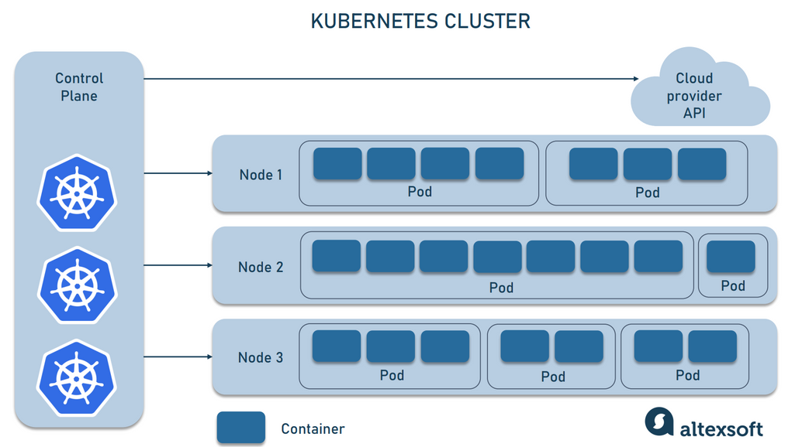

# Setting Up a Containerized Node.js Environment with Docker Compose



## 🧾 Introduction

If you're developing an application, Docker can make your workflow simpler and more efficient. It also helps when you're ready to deploy your app to a live environment.

Using containers during development offers these benefits:

- Consistent development environments across teams
- Isolation of dependencies
- Easy sharing and onboarding

In this tutorial, you’ll learn how to create a development environment for a [Node.js](https://nodejs.org/en) app using Docker. We’ll use **Docker Compose** to configure the application and services in containers.

---

## ⚙️ Prerequisites

Make sure you have the following installed:

- [Docker Desktop](https://www.docker.com/products/docker-desktop/)
- Basic understanding of Node.js and Express

---

## 🏗️ Step 1: Project Structure

Here’s how your project structure will look:

project-root/
│
├── docker-compose.yml
├── Dockerfile
├── package.json
└── index.js


---

## 🧱 Step 2: Initialize a Node.js App

```bash
npm init -y
npm install express
