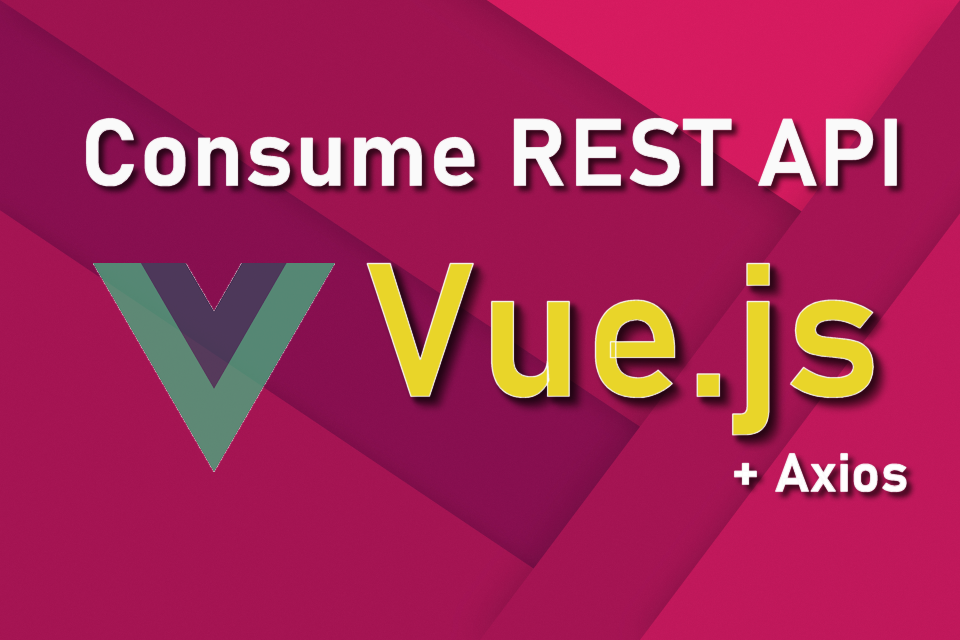

# How to Connect Vue.js with REST APIs via Axios



## 📘 Introduction

With Vue 2.0, the core team removed the built-in HTTP client, recommending third-party libraries instead. One of the most popular options is **Axios** — a promise-based HTTP client that works in both browser and Node.js environments.

In this tutorial, you'll learn how to:

- Integrate Axios in a Vue.js project
- Use Axios for GET and POST requests
- Centralize Axios configuration for reusability

---

## 🛠️ Prerequisites

Make sure you have the following installed:

- **Node.js**
- **Vue CLI**

```bash
npm install -g @vue/cli

🏗️ Project Setup

vue create vue-axios-guide
cd vue-axios-guide
npm install axios

🧱 Project Structure

src/
├── main.js
├── App.vue
└── services/
    └── api.js
